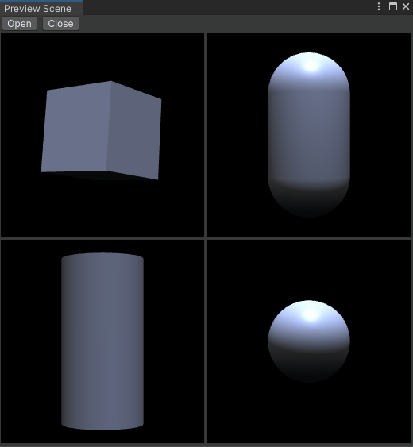
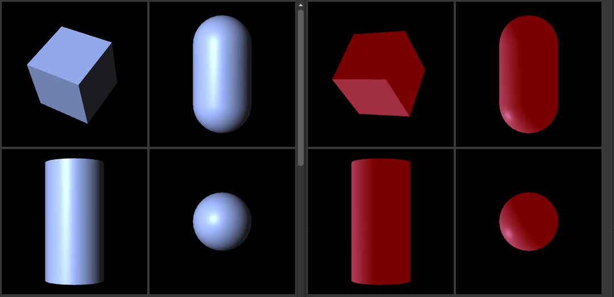

# Preview Scene
Unity editor extension for drawing object previews

## Motivation
Unity provides an official API function to render object previews: [AssetPreview.GetAssetPreview](https://docs.unity3d.com/ScriptReference/AssetPreview.GetAssetPreview.html)
However, as of Unity 2021, this only supports the default preview which the editor also shows e.g. in the project browser and there is almost no way to customize its appearance.

There is also a currently undocumented API class called [PreviewRenderUtility](https://github.com/Unity-Technologies/UnityCsReference/blob/master/Editor/Mono/Inspector/PreviewRenderUtility.cs) which offers greater control over the preview creation process but its lack of examples and API design makes it difficult to use.

The 'Preview Scene' extension attempts to be easy to understand, allow for better performance and have greater flexibility than Unity's builtin solutions.

## Features
- Documentation and example that shows how to build a custom preview scene.
- Survives assembly reload (no scene rebuild required during enter-playmode or script compilation).
- Lightweight drawing method (no texture allocations per frame).
- A simple system to reuse the same preview scene instance to draw multiple different previews. This allows drawing e.g. 50 objects with low memory overhead and no editor lag.
- Flexible use for IMGUI or UI Toolkit.
- Use active scene environment lighting or custom settings.

## Getting Started
Place the 'PreviewScene' directory anywhere in Unity 'Assets' and make sure the code is compiled editor-only (e.g. via 'Editor' folder oder ASMDEF). If you would like to use the extension as a package, please open a pull request which converts it to the correct format and makes use of the 'Samples' feature, thank you!

To see the extension in action, open the menu 'Nementic/Examples/Preview Scene'. The 'PreviewSceneExample' demonstrates how PreviewScene can be used within IMGUI. 'PreviewSceneExample_UITK' shows an implementation using UI Toolkit.

For more information see the inline documentation in the [PreviewScene](PreviewScene/PreviewScene.cs) file.

## Compatibility
The extension was tested in Unity 2020.3 and 2021.1.
